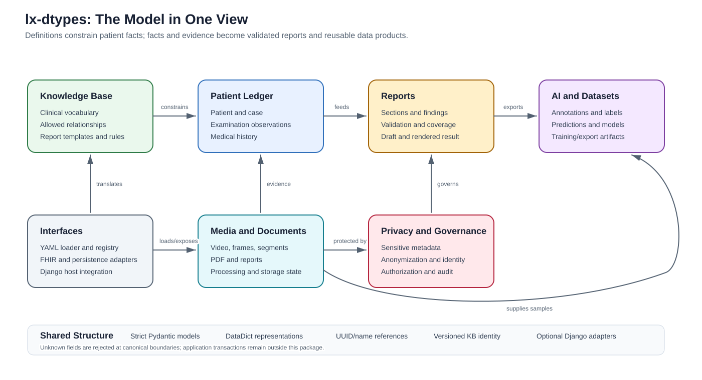
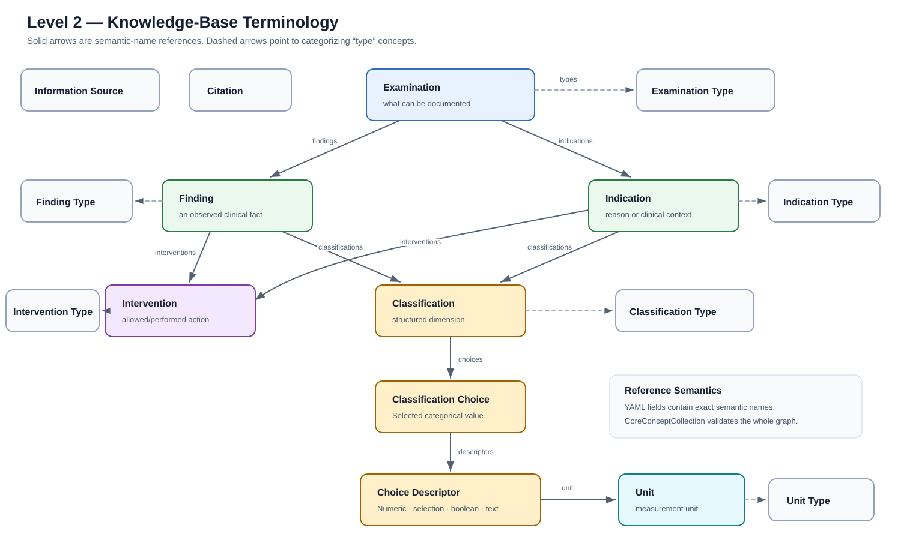
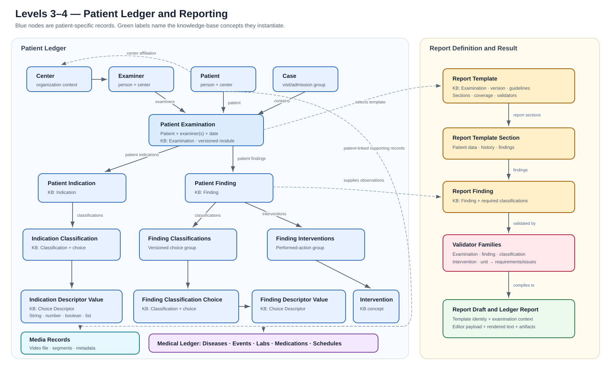

# Data-model concept map

This page is the public, layered map of the current `lx-dtypes` model. Start at
Level 0 and stop when you have enough detail. The full inventory is split into
levels because a single graph would contain hundreds of leaf payload types and
would not be readable.

The {download}`machine-readable map <../data-model-concept-map.yml>` is the source
inventory for this page. It records every model area, the complete knowledge-base
and ledger registries, important fields, and the current contract-module
families.

## How to read the map

- An unprefixed clinical name such as `Finding` is a reusable knowledge-base
  definition: it describes what is allowed.
- A `P`-prefixed name such as `PFinding` is a patient-specific ledger record: it
  describes what was observed.
- Knowledge-base relations use exact semantic names in YAML. Ledger relations
  use UUID strings or nested validated models, depending on the representation.
- A solid arrow means “contains or references.” A dashed arrow is a cross-layer
  link or categorization.
- `*Type` concepts categorize a concept. `ClassificationChoice` supplies an
  allowed value. `ClassificationChoiceDescriptor` supplies an additional typed
  value such as a number, text, boolean, selection, or measurement.

## Level 0 — the whole package



The central path is:

> **Knowledge base → patient ledger → report → data product**

Media and documents provide evidence, AI contracts turn evidence into labels or
predictions, and privacy/governance contracts protect those flows. Interface
models translate external YAML, FHIR, storage, and Django representations into
the package-owned contracts.

| Area | Question it answers | Principal structures |
|---|---|---|
| Knowledge base | What may be documented? | terminology, types, report templates, validators |
| Patient ledger | What happened for this patient? | patient, case, examination, finding, indication, intervention, medical history |
| Reports | What must be shown and is it complete? | sections, requirements, graph, coverage, draft, rendered report |
| Media and documents | What evidence exists and what state is it in? | video, frame, segment, PDF, metadata, storage and processing state |
| AI and datasets | How is evidence labeled or learned from? | annotations, datasets, exports, predictions, model metadata |
| Privacy and governance | May this data be used or transferred? | sensitive metadata, anonymization, identity, authorization, audit |
| Interfaces | How does data enter, leave, or persist? | loaders, registries, FHIR, persistence payloads, Django host contracts |

## Level 1 — shared structure and representations

Most domain models share a small inheritance backbone:

```text
AppBaseModel                              source_file, created_at
└── AppBaseModelUUIDTags                  uuid, tags
    ├── AppBaseModelNamesUUIDTags         name, name_de, name_en, description
    │   └── KnowledgebaseBaseModel        kb_module_name
    ├── LedgerBaseModel                   external_ids, nested→serialized flattening
    ├── MetaBaseModel
    └── StateBaseModel
```

The same concept may have several deliberately separate representations:

| Representation | Role |
|---|---|
| Pydantic model | Canonical runtime validation and model behavior |
| `DataDict` | Typed dictionary and compatibility representation |
| Serialized ledger model | Nested ledger objects flattened to identifiers |
| Core contract | Strict cross-service/API shape with no application behavior |
| Django model or host contract | Optional persistence adapter; coverage is intentionally not one-to-one |

`AppBaseModel` strips surrounding whitespace, validates defaults, rejects unknown
fields, and revalidates nested model instances. External data should cross one of
these validated boundaries once, rather than coexist with a loose dictionary.

## Level 2 — knowledge-base terminology



The `KnowledgeBase` aggregates 25 registered model types. The terminology graph
itself has 17 concepts; 7 are categorizing type concepts.

| Definition | Direct references or special fields |
|---|---|
| `Examination` | `examination_types`, `findings`, `indications` |
| `Finding` | `finding_types`, `classifications`, `interventions`, `caused_by_interventions` |
| `Indication` | `indication_types`, `classifications`, `interventions` |
| `Intervention` | `intervention_types` |
| `Classification` | `classification_types`, `classification_choices` |
| `ClassificationChoice` | `classification_choice_descriptors` |
| `ClassificationChoiceDescriptor` | descriptor type, numeric/selection/boolean/text constraints, optional `unit` |
| `Unit` | `abbreviation`, `unit_types` |
| `InformationSource` | `information_source_types` |
| `Citation` | bibliographic identity, authors, publication data, DOI/URL, identifiers |

The categorizing concepts are `ExaminationType`, `FindingType`,
`IndicationType`, `InterventionType`, `ClassificationType`, `UnitType`, and
`InformationSourceType`. `ClassificationChoiceDescriptor` has descriptor-type
behavior rather than a separate registered `*Type` model.

`KnowledgeBaseIdentity` is the version boundary. It requires both
`knowledge_base_module` and `knowledge_base_version` and has the canonical form
`module@version`. `CoreConceptCollection` is the strict cross-layer snapshot: it
rejects duplicate concept names, reused UUIDs, dangling semantic-name
references, unknown fields, and incomplete knowledge-base identity pairs.

## Level 3 — patient ledger



The ledger registry contains 24 named model types in four branches.

### Examination branch

```text
Center ─┬─ Examiner
        └─ Patient ─ Case
                     └─ PExamination [Examination + module@version]
                        ├─ PIndication [Indication]
                        │  └─ PIndicationClassification [Classification + Choice]
                        │     └─ PIndicationClassificationDescriptor [Descriptor value]
                        └─ PFinding [Finding]
                           ├─ PFindingClassifications
                           │  └─ PFindingClassificationChoice [Classification + Choice]
                           │     └─ PFindingClassificationChoiceDescriptor [Descriptor value]
                           └─ PFindingInterventions
                              └─ PFindingIntervention [Intervention]
```

Square brackets show the knowledge-base definition referenced by a patient
record. Descriptor values are the actual patient values and accept string,
integer, float, boolean, or a list of strings.

### Report, medical, and media branches

- `Case` groups patient examinations and report identifiers between admission
  and discharge dates.
- Ledger `Report` stores the examination link, immutable template identity,
  lifecycle status, editor payload, context snapshots, rendered text, and
  version state.
- `PatientMedicalLedger` groups `PatientDisease`, `PatientEvent`,
  `PatientLabSample`, `PatientLabValue`, `PatientMedication`, and
  `PatientMedicationSchedule`.
- `VideoFile` and `PatientVideoFile` connect patient and examination context to
  technical metadata, segments, storage paths, anonymization state, and
  sensitive metadata.

The ledger has both nested and serialized forms. Nested forms are convenient for
validation and traversal; serialized forms replace nested records with UUID
references for transport or persistence.

## Level 4 — reports and validators

`ReportTemplate` is a knowledge-base definition, not the produced patient
report. It selects one `Examination`, versioned guideline references, coverage
concepts, ordered sections, and five validator families.

```text
ReportTemplate
├── ReportTemplateSection
│   ├── patient/history fields
│   └── ReportFinding
│       └── required Classification references
├── ExaminationValidator
├── FindingsValidator
├── ClassificationValidator
├── InterventionValidator
└── UnitValidator
    └── ValidatorRequirementReference
        └── finding | classification | choice | intervention | unit
```

The template can be compiled into `ReportTemplateGraph`, assessed as
`ReportConceptCoverage`, checked structurally, and evaluated against a concrete
ledger examination at runtime. `PatientExaminationReportDraft` binds the
template identity to editable examination content. Submission/make-report
contracts produce persisted artifacts and the ledger `Report`.

This separation answers three different questions:

1. **Structure:** Is the template graph internally valid?
2. **Coverage:** Does the template represent the intended clinical concepts?
3. **Runtime:** Does this patient examination satisfy the applicable rules?

## Level 5 — supporting contract families

Leaf request, response, enum, `TypedDict`, and helper models are grouped below by
their owning concept family. This is the readable final level; the YAML inventory
contains the exact current module list for every group.

| Family | Included concepts |
|---|---|
| Contract infrastructure | canonical storage adapters and closed JSON value types |
| Clinical and terminology | assessment, contraindication, events, examination time/type/indication, finding classification/intervention, information source, lab value, medication schedule, risks, subcategories |
| Reporting and documents | report context/draft/anonymization, report submission and artifacts, PDF identity/metadata/redaction, document type |
| Video and media | processor/ROI, video identity and format, frames and boxes, segments, correction, processing/history, cache, streaming, export, reimport, temporal inference |
| AI and annotation | frame annotations, datasets and buckets, active learning, labels, prediction, model metadata, Hugging Face, multilabel classification, LLM extraction/service |
| Privacy, identity, and audit | sensitive metadata, anonymization state/quality/metrics, pseudonymization, OCR/text detection, validated identity, authorization, audit ledger |
| Transfer, configuration, and operations | application/Django/setup settings, persistence, DICOM, hub ingest/transfer, uploads, imports, migrations, repair, management commands, permissions, translation |

The metadata branch adds three cross-cutting structures:

- `SensitiveMeta` and `SensitiveMetaState` hold sensitive-data identity and
  lifecycle state.
- `VideoMeta` adds ROI, PHI-region, observation, removal-plan, format-probe, and
  anonymizer-provenance structures.
- `ReportMeta` adds parsed patient/examiner/examination/endoscope information,
  redaction/crop state, and report-processing provenance.

## External boundaries

| Boundary | Entry/result |
|---|---|
| YAML | `DataLoader`, `KnowledgeBaseConfig`, and `KnowledgeBase` produce a validated module graph |
| Registry | `KnowledgeBaseResolver` selects an exact registered `module@version` |
| FHIR terminology | CodeSystem/Bundle conversion maps supported domains to knowledge-base collections |
| FHIR clinical | Strict Patient, Observation, Condition, DiagnosticReport, coding, quantity, and bundle contracts |
| Persistence | `DtypesRecordPersistencePayload` carries a validated examination tree and optional complete KB identity |
| Django | Package adapters and explicit host contracts map selected models to persistence; transactions stay with the host application |
| Public API | Snake-case Pydantic contracts are canonical; frontend casing belongs in one named transport adapter |

## Scope and maintenance

This is a concept map, not a promise that every class is a database table and
not a field-by-field API reference. Test fixtures, migrations, generated docs,
and implementation-only helpers are outside the map. A new public model area
must be added to the machine-readable inventory and to the appropriate level on
this page; a changed relationship must update both in the same change.

For detailed authoring and boundary rules, continue with
[Knowledge-base authoring](knowledge-base-authoring.md),
[Cross-layer validation](cross-layer-validation.md), and
[Django host integration](django-host-integration.md).
