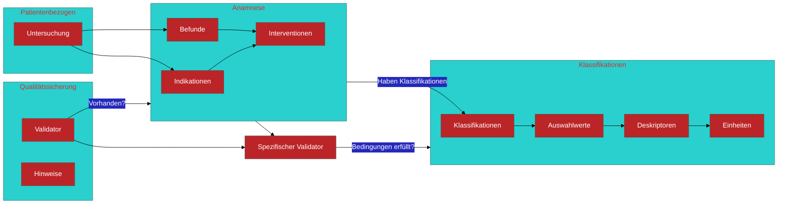

# Konzept-Verknuepfungen

Diese Datei beschreibt die wichtigsten fachlichen Konzepte in `lx-data-models`
und wie sie miteinander verknuepft sind.

Leserichtung:

- `A -> B` bedeutet: `A` referenziert `B` ueber Namen/IDs in einem Feld.
  In YAML sind diese Referenzen in der Regel exakte String-Matches.
- Deutsche Begriffe stehen vorne, die Modell- oder Feldnamen aus dem Code stehen
  in Klammern.
- Die Terminologie-Objekte definieren, was fachlich erlaubt ist. Die
  Bericht- und Validator-Objekte legen fest, was in einem konkreten Bericht
  angezeigt und geprueft wird.

## Gesamtbild

```text
Berichte
+-- Untersuchung
    +-- Untersuchungstypen
    +-- Befunde
    |   +-- Befundtypen
    |   +-- Klassifikationen
    |   |   +-- Klassifikationstypen
    |   |   +-- Auswahlwerte
    |   |       +-- Deskriptoren
    |   |           +-- Einheiten
    |   +-- Interventionen
    +-- Indikationen
        +-- Indikationstypen
        +-- Klassifikationen
        +-- Interventionen

Berichte
+-- Berichtsabschnitte
|   +-- Berichtsbefunde
|       +-- Befunde
|       +-- Klassifikationen
+-- Validatoren
    +-- Befund-Validatoren
    +-- Klassifikations-Validatoren
    +-- Interventions-Validatoren
    +-- Einheiten-Validatoren
    +-- Untersuchungs-Validatoren
```

## Mermaid-Diagramm

```mermaid
---
config:
  theme: 'base'
  themeVariables:
    primaryColor: '#BB2528'
    primaryTextColor: '#fff'
    primaryBorderColor: '#7C0000'
    lineColor: '#F8B229'
    secondaryColor: '#006100'
    tertiaryColor: '#fff'
---
flowchart TD
  subgraph T["Terminologie"]
    E["Untersuchungen<br/>(examination)"]
    ET["Untersuchungstypen<br/>(examination_type)"]
    F["Befunde<br/>(finding)"]
    FT["Befundtypen<br/>(finding_type)"]
    I["Indikationen<br/>(indication)"]
    IT["Indikationstypen<br/>(indication_type)"]
    INT["Interventionen<br/>(intervention)"]
    INTT["Interventionstypen<br/>(intervention_type)"]
    C["Klassifikationen<br/>(classification)"]
    CT["Klassifikationstypen<br/>(classification_type)"]
    CH["Auswahlwerte<br/>(classification_choice)"]
    D["Deskriptoren<br/>(classification_choice_descriptor)"]
    U["Einheiten<br/>(unit)"]
    UT["Einheitentypen<br/>(unit_type)"]
  end

  subgraph B["Berichte und Validierung"]
    RT["Berichte<br/>(report_template)"]
    SEC["Berichtsabschnitte<br/>(report_template_section)"]
    RF["Berichtsbefunde<br/>(report_finding)"]
    FV["Befund-Validatoren<br/>(findings_validator)"]
    CV["Klassifikations-Validatoren<br/>(classification_validator)"]
    IV["Interventions-Validatoren<br/>(intervention_validator)"]
    UV["Einheiten-Validatoren<br/>(unit_validator)"]
    EV["Untersuchungs-Validatoren<br/>(examination_validator)"]
  end


  RT -->|examination| E
  E -->|examination_types| ET
  E -->|findings| F
  E -->|indications| I

  F -->|finding_types| FT
  F -->|classifications| C
  F -->|interventions| INT
  F -->|caused_by_interventions| INT

  I -->|indication_types| IT
  I -->|classifications| C
  I -->|interventions| INT

  INT -->|intervention_types| INTT
  C -->|classification_types| CT
  C -->|classification_choices| CH
  CH -->|classification_choice_descriptors| D
  D -->|unit| U
  U -->|unit_types| UT

  RT -->|report_sections| SEC
  SEC -->|findings| RF
  RF -->|finding| F
  RF -->|classifications| C

  RT -->|validators.findings_validators| FV
  RT -->|validators.classification_validators| CV
  RT -->|validators.intervention_validators| IV
  RT -->|validators.unit_validators| UV
  RT -->|validators.examination_validators| EV

  FV -->|finding| F
  FV -->|condition.classification| C
  FV -->|then_requires| F
  FV -->|then_requires| C
  FV -->|then_requires| INT
  FV -->|then_requires| U

  CV -->|finding| F
  CV -->|classification| C
  CV -->|condition.classification| C
  CV -->|then_requires| F
  CV -->|then_requires| C
  CV -->|then_requires| INT
  CV -->|then_requires| U

  IV -->|finding| F
  IV -->|intervention| INT
  IV -->|condition.classification| C
  IV -->|then_requires| F
  IV -->|then_requires| C
  IV -->|then_requires| INT
  IV -->|then_requires| U

  UV -->|finding| F
  UV -->|classification| C
  UV -->|unit| U
  UV -->|condition.classification| C
  UV -->|then_requires| F
  UV -->|then_requires| C
  UV -->|then_requires| INT
  UV -->|then_requires| U

  EV -->|finding_validators| FV
  EV -->|examination_validators| EV
```



## Abstrahiertes Terminologie-Diagramm

Dieses Diagramm zeigt nur die Terminologieebene. Es fasst technische
Zwischenobjekte wie `*_type` zusammen und zeigt die fachlichen Hauptpfade.



## Terminologie-Hierarchie

### Untersuchungen (`examination`)

Untersuchungen sind die Verbindungsebene fuer Untersuchungsarten, Befunde und
Indikationen.

- `examination.examination_types -> examination_type`
  - Untersuchungstypen gruppieren oder typisieren Untersuchungen.
- `examination.findings -> finding`
  - Befunde, die innerhalb dieser Untersuchung auftreten koennen.
- `examination.indications -> indication`
  - Indikationen, die fuer diese Untersuchung erlaubt oder relevant sind.

### Befunde (`finding`)

Befunde sind terminologische Befunde, die in einer Untersuchung dokumentiert
werden koennen.

- `finding.finding_types -> finding_type`
  - Befundtypen gruppieren oder typisieren Befunde.
- `finding.classifications -> classification`
  - Klassifikationen beschreiben den Befund genauer, zum Beispiel Morphologie,
    Lokalisation, Groesse oder Schweregrad.
- `finding.interventions -> intervention`
  - Interventionen, die fuer diesen Befund verfuegbar oder erlaubt sind.
- `finding.caused_by_interventions -> intervention`
  - Interventionen, die diesen Befund verursachen koennen.

### Indikationen (`indication`)

Indikationen beschreiben Gruende, Verlaufskontrollen oder klinische Kontexte fuer
Untersuchungen.

- `indication.indication_types -> indication_type`
  - Indikationstypen gruppieren oder typisieren Indikationen.
- `indication.classifications -> classification`
  - Klassifikationen, die eine Indikation genauer beschreiben.
- `indication.interventions -> intervention`
  - Interventionen, die im Kontext der Indikation relevant sein koennen.
- `examination.indications -> indication`
  - Eine Untersuchung legt fest, welche Indikationen zu ihr gehoeren.

### Interventionen (`intervention`)

Interventionen sind verfuegbare Massnahmen oder Prozeduren.

- `intervention.intervention_types -> intervention_type`
  - Interventionstypen gruppieren oder typisieren Interventionen.
- `finding.interventions -> intervention`
  - Befunde legen fest, welche Interventionen fuer sie dokumentierbar sind.
- `finding.caused_by_interventions -> intervention`
  - Befunde koennen Interventionen referenzieren, die sie verursacht haben.
- `indication.interventions -> intervention`
  - Indikationen koennen relevante Interventionen referenzieren.

### Klassifikationen (`classification`)

Klassifikationen sind strukturierte Dimensionen wie Morphologie, Lokalisation,
Schweregrad, Groesse oder andere Auswahl- und Messdimensionen.

- `classification.classification_types -> classification_type`
  - Klassifikationstypen gruppieren oder typisieren Klassifikationen.
- `classification.classification_choices -> classification_choice`
  - Erlaubte Auswahlwerte fuer diese Klassifikation.
- `finding.classifications -> classification`
  - Befunde legen fest, welche Klassifikationen auf sie anwendbar sind.
- `indication.classifications -> classification`
  - Indikationen koennen eigene Klassifikationen haben.

### Auswahlwerte (`classification_choice`)

Auswahlwerte sind atomare Werte, aus denen Klassifikationen aufgebaut werden.

- `classification_choice.classification_choice_descriptors -> classification_choice_descriptor`
  - Optionale Zusatzangaben zu einem Auswahlwert.
- `classification.classification_choices -> classification_choice`
  - Eine Klassifikation definiert ihre erlaubten Auswahlwerte.

### Deskriptoren (`classification_choice_descriptor`)

Deskriptoren beschreiben Zusatzangaben zu Auswahlwerten, zum Beispiel Zahlen,
Texte, Boolean-Werte oder Mehrfachauswahlen.

- `classification_choice_descriptor.classification_choice_descriptor_type`
  - Typ des Deskriptors, zum Beispiel numerisch, Text, Auswahl oder Boolean.
- `classification_choice_descriptor.unit -> unit`
  - Einheit fuer numerische Angaben.
- `classification_choice_descriptor.numeric_min` / `numeric_max`
  - Grenzen fuer numerische Werte.
- `classification_choice_descriptor.text_max_length`
  - Begrenzung fuer Textwerte.
- `classification_choice_descriptor.selection_options`
  - Erlaubte Optionen fuer Auswahl-Deskriptoren.

### Einheiten (`unit`)

Einheiten sind wiederverwendbare Einheiten fuer numerische Angaben wie
Laborwerte, Groessen oder Zeitdauern.

- `unit.unit_types -> unit_type`
  - Einheitentypen gruppieren oder typisieren Einheiten.
- `unit.abbreviation`
  - Kurzschreibweise der Einheit.
- `classification_choice_descriptor.unit -> unit`
  - Deskriptoren koennen eine Einheit referenzieren.
- `unit_validator.unit -> unit`
  - Einheiten-Validatoren pruefen Einheiten im Kontext einer Klassifikation.

## Berichte und Berichtsstruktur

### Berichte (`report_template`)

Berichte verbinden Untersuchung, Berichtsbefunde und Validatoren.

- `report_template.examination -> examination`
  - Der Bericht gilt fuer genau eine Untersuchung.
- `report_template.report_sections -> report_template_section`
  - Berichtsabschnitte bestimmen Struktur und Reihenfolge.
- `report_template.validators.examination_validators -> examination_validator`
  - Gruppen von Untersuchungs- und Befundregeln.
- `report_template.validators.findings_validators -> findings_validator`
  - Direkte Befundregeln.
- `report_template.validators.classification_validators -> classification_validator`
  - Direkte Klassifikationsregeln.
- `report_template.validators.intervention_validators -> intervention_validator`
  - Direkte Interventionsregeln.
- `report_template.validators.unit_validators -> unit_validator`
  - Direkte Einheitenregeln.

### Berichtsabschnitte (`report_template_section`)

Berichtsabschnitte sind keine Terminologie-Konzepte, aber sie ordnen die
Berichtsinhalte.

- `report_template_section.findings -> report_finding`
  - Ein Abschnitt kann wiederverwendbare Berichtsbefunde referenzieren.
- `report_template_section.findings -> inline finding requirement`
  - Alternativ kann ein Abschnitt Befundanforderungen direkt einbetten.
- `report_template_section.fields`
  - Optional fuer Patienten-, Untersuchungs- oder Anamnese-Felder.

### Berichtsbefunde (`report_finding`)

Berichtsbefunde sind die berichtsnahe Sicht auf Terminologie-Befunde.

- `report_finding.finding -> finding`
  - Der fachliche Befund.
- `report_finding.classifications[].classification -> classification`
  - Klassifikationen, die im Bericht fuer diesen Befund erwartet werden.
- `report_finding.required`
  - Markiert, ob der Befund im Template erwartet wird.
- `report_finding.multiple_allowed`
  - Markiert, ob der Befund mehrfach vorkommen darf.

## Validator-Hierarchie

### Befund-Validatoren (`findings_validator`)

Befund-Validatoren pruefen, ob ein Befund vorhanden ist, fehlt oder bei einer
Bedingung weitere Angaben ausloest.

- `findings_validator.finding -> finding`
  - Zielbefund der Regel.
- `findings_validator.operator`
  - `exists`, `missing` oder `condition`.
- `findings_validator.query.condition.any/all[].classification -> classification`
  - Bedingung liest Klassifikationswerte des Zielbefunds.
- `findings_validator.query.condition.then_requires[]`
  - Kann weitere `classification`, `finding`, `intervention` oder `unit`
    Anforderungen ausloesen.

### Klassifikations-Validatoren (`classification_validator`)

Klassifikations-Validatoren pruefen, ob eine Klassifikation fuer einen Befund
vorhanden ist, fehlt oder bedingt verlangt wird.

- `classification_validator.finding -> finding`
  - Zielbefund der Regel.
- `classification_validator.classification -> classification`
  - Zielklassifikation der Regel.
- `classification_validator.operator`
  - `exists`, `missing` oder `condition`.
- `classification_validator.precedence`
  - `required` oder `optional`.
- `classification_validator.query.condition.any/all[].classification -> classification`
  - Bedingung liest Klassifikationswerte des Zielbefunds.
- `classification_validator.query.condition.then_requires[]`
  - Kann weitere Anforderungen an Befund, Klassifikation, Intervention oder
    Einheit ausloesen.

### Interventions-Validatoren (`intervention_validator`)

Interventions-Validatoren pruefen, ob eine Intervention fuer einen Befund
vorhanden ist, fehlt oder bedingt verlangt wird.

- `intervention_validator.finding -> finding`
  - Zielbefund der Regel.
- `intervention_validator.intervention -> intervention`
  - Zielintervention der Regel.
- `intervention_validator.operator`
  - `exists`, `missing` oder `condition`.
- `intervention_validator.precedence`
  - `required` oder `optional`.
- `intervention_validator.query.condition.any/all[].classification -> classification`
  - Bedingung liest Klassifikationswerte des Zielbefunds.
- `intervention_validator.query.condition.then_requires[]`
  - Kann weitere Anforderungen an Befund, Klassifikation, Intervention oder
    Einheit ausloesen.

### Einheiten-Validatoren (`unit_validator`)

Einheiten-Validatoren pruefen, ob eine Einheit fuer eine numerische oder
einheitenbezogene Klassifikation vorhanden ist, fehlt oder bedingt verlangt wird.

- `unit_validator.finding -> finding`
  - Zielbefund der Regel.
- `unit_validator.classification -> classification`
  - Zielklassifikation, unter der die Einheit erwartet wird.
- `unit_validator.unit -> unit`
  - Zieleinheit der Regel.
- `unit_validator.operator`
  - `exists`, `missing` oder `condition`.
- `unit_validator.precedence`
  - `required` oder `optional`.
- `unit_validator.query.condition.any/all[].classification -> classification`
  - Bedingung liest Klassifikationswerte des Zielbefunds.
- `unit_validator.query.condition.then_requires[]`
  - Kann weitere Anforderungen an Befund, Klassifikation, Intervention oder
    Einheit ausloesen.

### Untersuchungs-Validatoren (`examination_validator`)

Untersuchungs-Validatoren gruppieren Regeln. Sie pruefen nicht direkt einzelne
Payload-Werte, sondern buendeln andere Validatoren.

- `examination_validator.finding_validators -> findings_validator`
  - Gruppiert atomare Befundregeln.
- `examination_validator.examination_validators -> examination_validator`
  - Erlaubt verschachtelte Regelgruppen.
- `report_template.validators.examination_validators -> examination_validator`
  - Ein Bericht entscheidet, welche Regelgruppen ausgefuehrt werden.

## Wichtige Querverbindungen

- Untersuchungen bestimmen, welche Befunde und Indikationen im Kontext erlaubt
  sind.
- Befunde bestimmen, welche Klassifikationen und Interventionen dokumentiert
  werden koennen.
- Klassifikationen bestimmen, welche Auswahlwerte erlaubt sind.
- Auswahlwerte koennen Deskriptoren haben.
- Deskriptoren koennen Einheiten referenzieren.
- Berichte referenzieren eine Untersuchung und waehlen Berichtsabschnitte sowie
  Validatoren aus.
- Berichtsbefunde referenzieren Terminologie-Befunde und erwartete
  Klassifikationen.
- Validatoren pruefen runtime-seitig, ob ein ausgefuellter Bericht die im
  Template definierten Anforderungen erfuellt.

## Modellnamen im Code

| Deutscher Begriff | Modellname im Code |
| --- | --- |
| Untersuchungen | `examination` / `Examination` |
| Untersuchungstypen | `examination_type` / `ExaminationType` |
| Befunde | `finding` / `Finding` |
| Befundtypen | `finding_type` / `FindingType` |
| Indikationen | `indication` / `Indication` |
| Indikationstypen | `indication_type` / `IndicationType` |
| Interventionen | `intervention` / `Intervention` |
| Interventionstypen | `intervention_type` / `InterventionType` |
| Klassifikationen | `classification` / `Classification` |
| Klassifikationstypen | `classification_type` / `ClassificationType` |
| Auswahlwerte | `classification_choice` / `ClassificationChoice` |
| Deskriptoren | `classification_choice_descriptor` / `ClassificationChoiceDescriptor` |
| Einheiten | `unit` / `Unit` |
| Einheitentypen | `unit_type` / `UnitType` |
| Befund-Validatoren | `findings_validator` / `FindingsValidator` |
| Klassifikations-Validatoren | `classification_validator` / `ClassificationValidator` |
| Interventions-Validatoren | `intervention_validator` / `InterventionValidator` |
| Einheiten-Validatoren | `unit_validator` / `UnitValidator` |
| Untersuchungs-Validatoren | `examination_validator` / `ExaminationValidator` |
| Berichte | `report_template` / `ReportTemplate` |
| Berichtsabschnitte | `report_template_section` / `ReportTemplateSection` |
| Berichtsbefunde | `report_finding` / `ReportFinding` |

## Relevante Quelldateien

- `lx_dtypes/models/knowledge_base/examination/`
- `lx_dtypes/models/knowledge_base/finding/`
- `lx_dtypes/models/knowledge_base/indication/`
- `lx_dtypes/models/knowledge_base/intervention/`
- `lx_dtypes/models/knowledge_base/classification/`
- `lx_dtypes/models/knowledge_base/classification_choice/`
- `lx_dtypes/models/knowledge_base/classification_choice_descriptor/`
- `lx_dtypes/models/knowledge_base/unit/`
- `lx_dtypes/models/knowledge_base/report_template/`
