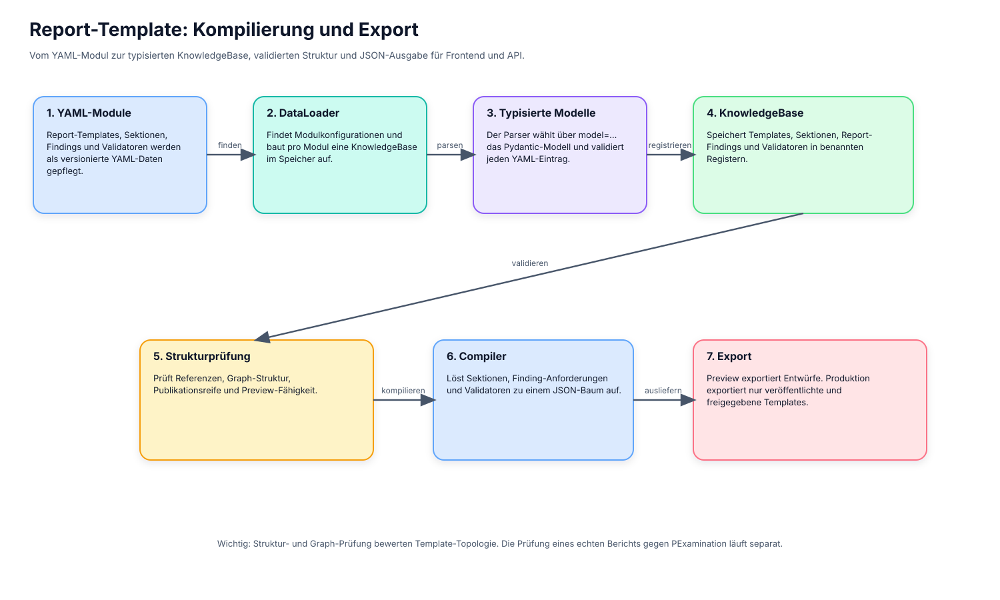
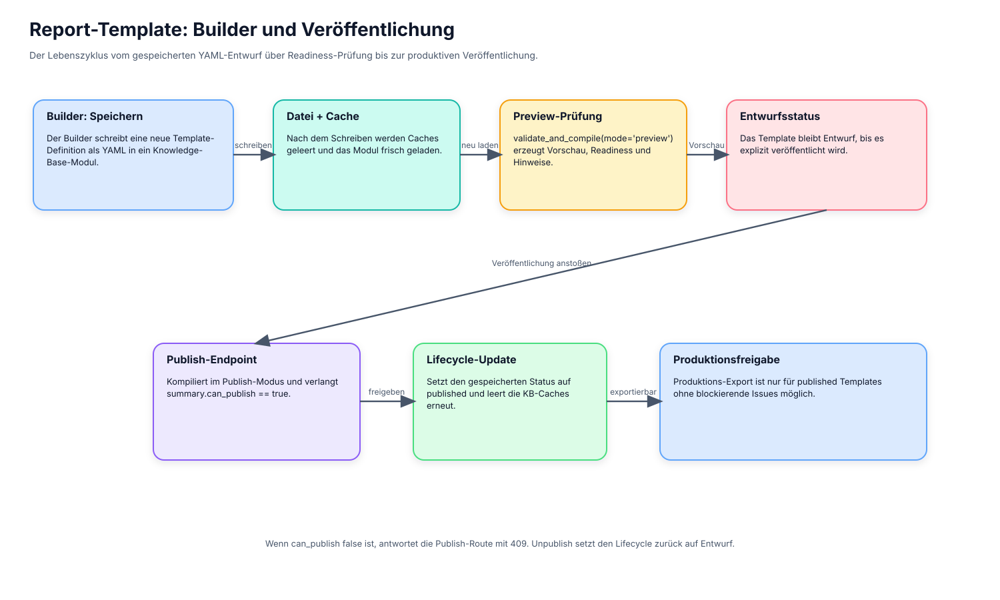
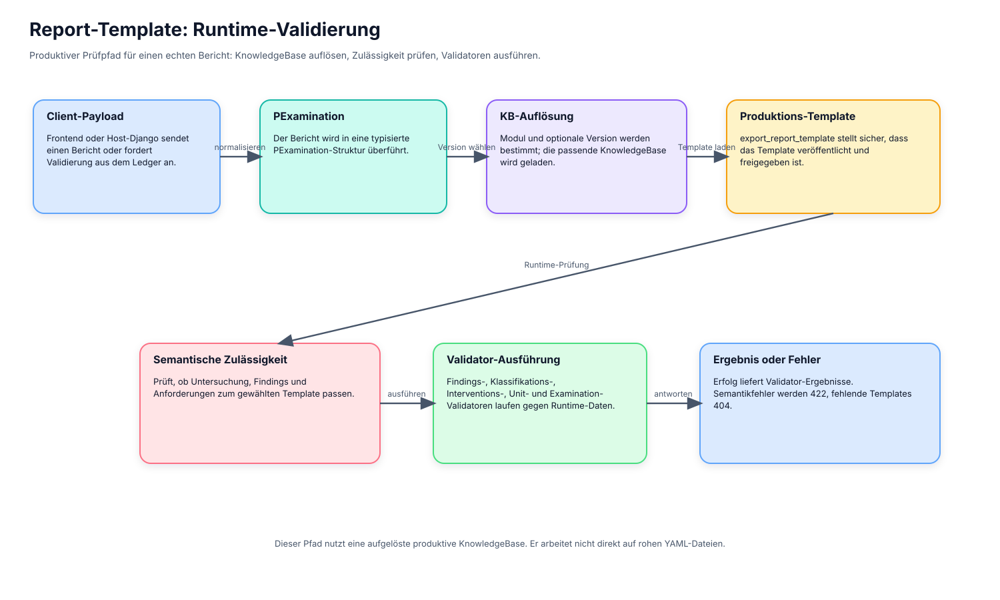

# Report-Template-Diagramme

Diese Diagramme fassen die drei zentralen Report-Template-Pfade in `lx-dtypes`
zusammen:

1. Kompilierung und Export
2. Speichern und Veröffentlichen im Builder
3. Runtime-Validierung gegen einen echten Untersuchungsbericht

Die Dateien werden aus `docs/diagrams/generate_report_template_diagrams.py`
generiert. Dadurch bleiben Layout, Text und Assets reproduzierbar.

## Kompilierung und Export

## Builder und Veröffentlichung

## Runtime-Validierung

